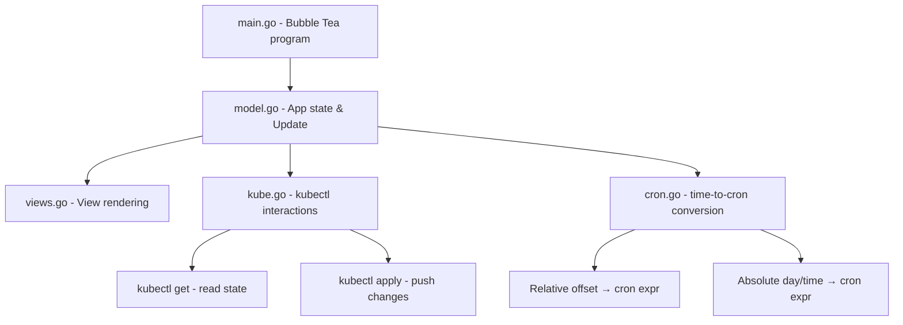

# Implementation Plan — kedacadabra TUI

## Problem Statement
Build a Go TUI (using Bubble Tea) to interactively view and update the KEDA CronJob schedules (`keda-pause-weekend` and `keda-resume-monday`) in the `apps` namespace. It supports both relative offsets ("pause in 5 minutes") and absolute day/time scheduling, displays current cluster state, and applies changes directly via `kubectl apply`.

## Requirements
- Bubble Tea (charmbracelet/bubbletea) TUI framework
- Dashboard showing: current CronJob schedules, ScaledObject paused status, current replica count
- Two scheduling modes: relative offset (converts to cron expression) and absolute day/time
- Applies updated YAML to cluster directly via `kubectl apply`
- Targets the two CronJobs in `keda-weekend-schedule.yaml`

## Background
- The repo has 4 YAML manifests: namespace, demo-app (Deployment + Service + ServiceMonitor), ScaledObject (Prometheus trigger), and the weekend schedule (ServiceAccount, Role, RoleBinding, 2 CronJobs)
- The pause CronJob annotates the ScaledObject with `autoscaling.keda.sh/paused-replicas=0`
- The resume CronJob removes that annotation with `autoscaling.keda.sh/paused-replicas-`
- Bubbles v2 provides: `textinput`, `table`, `spinner`, `list`, `help`, `key` components
- We use `os/exec` to shell out to `kubectl` for both reading state and applying changes

## Architecture

## Task Breakdown

### Task 1: Project scaffolding and cron conversion logic
- **Objective:** Initialize Go module, set up project structure, implement the core cron conversion functions
- **Implementation:**
  - `go mod init kedacadabra`
  - Create `cron.go` with two functions: `RelativeToCron(minutes int) string` and `AbsoluteToCron(weekday, hour, minute int) string`

### Task 2: kubectl interaction layer
- **Objective:** Build the `kube.go` module that reads cluster state and applies updated CronJob YAML
- **Implementation:**
  - `FetchStatus() (Status, error)` — runs kubectl commands, parses JSON output
  - `ApplyCronSchedule(pauseCron, resumeCron string) error` — updates YAML and applies

### Task 3: Bubble Tea model and status dashboard view
- **Objective:** Create the TUI skeleton with the status dashboard panel

### Task 4: Relative offset editor mode
- **Objective:** Add the "Relative" input mode

### Task 5: Absolute schedule editor mode
- **Objective:** Add the "Absolute" input mode

### Task 6: Polish — help bar, error handling, and keybindings
- **Objective:** Add help bar, proper error display, and final UX polish
