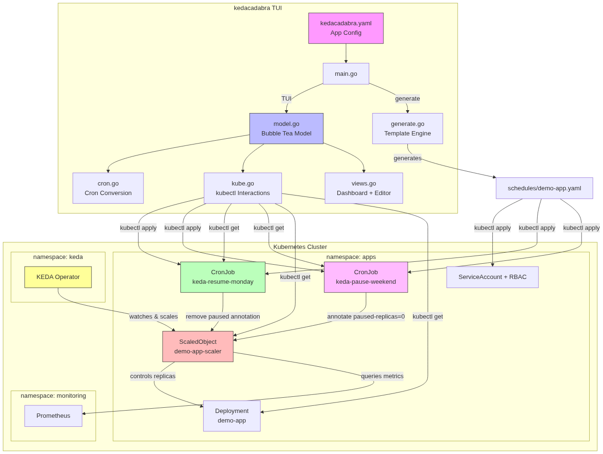
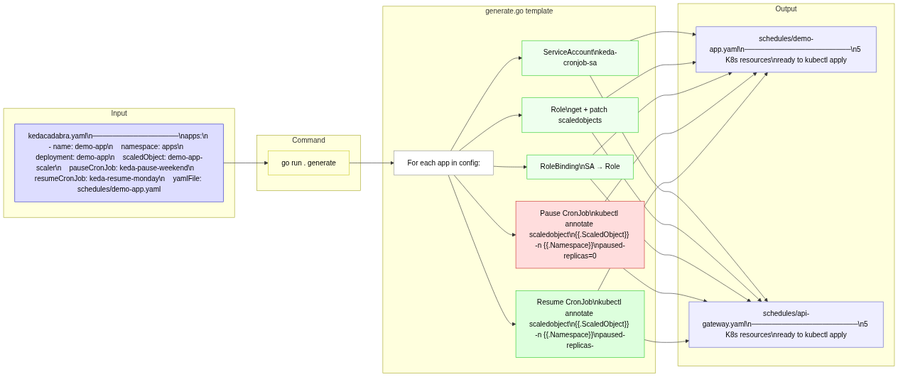
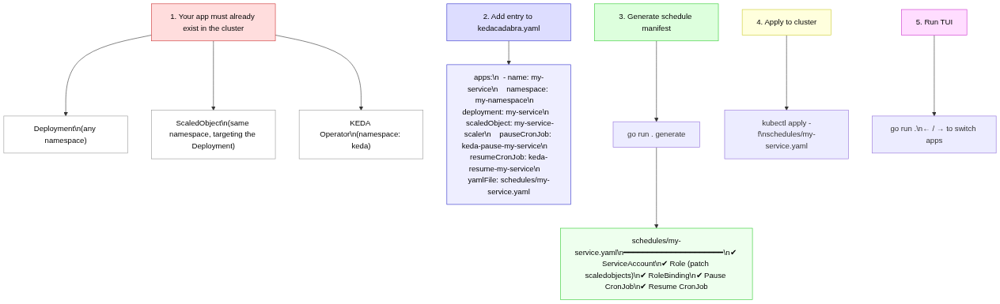
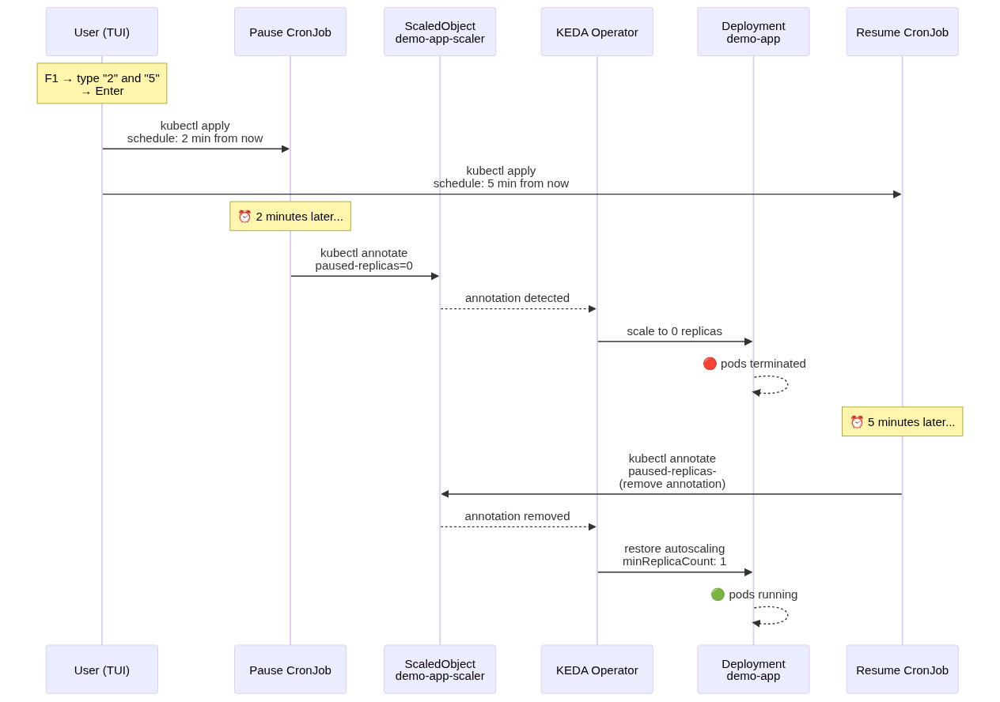

# kedacadabra ⚡

TUI to manage KEDA scale-to-zero schedules on Kubernetes. View cluster state and update CronJob schedules interactively. Supports multiple apps across namespaces.

## Architecture



## Prerequisites

- Go 1.25+
- `kubectl` configured and pointing at your cluster
- [KEDA](https://keda.sh) installed on the cluster

## Quick start

### 1. Apply the cluster prerequisites

```bash
kubectl apply -f manifests/namespace.yaml
kubectl apply -f manifests/demo-app.yaml
```

### 2. Configure your apps

Edit `kedacadabra.yaml` to define which apps to manage:

```yaml
apps:
  - name: demo-app
    namespace: apps
    deployment: demo-app
    scaledObject: demo-app-scaler
    pauseCronJob: keda-pause-weekend
    resumeCronJob: keda-resume-monday
    yamlFile: schedules/demo-app.yaml

  - name: api-gateway
    namespace: production
    deployment: api-gateway
    scaledObject: api-gateway-scaler
    pauseCronJob: keda-pause-api-gateway
    resumeCronJob: keda-resume-api-gateway
    yamlFile: schedules/api-gateway.yaml
```

### 3. Generate the schedule manifests



```bash
go run . generate
```

This creates a YAML file per app under `schedules/` with:
- ServiceAccount + Role + RoleBinding (RBAC for CronJobs to patch ScaledObjects)
- Pause CronJob (annotates ScaledObject with `paused-replicas=0`)
- Resume CronJob (removes the pause annotation)

### 4. Apply to your cluster

```bash
kubectl apply -f schedules/demo-app.yaml
kubectl apply -f schedules/api-gateway.yaml
```

### 5. Run the TUI

```bash
go run .
```

## Adding a new app



**Prerequisites in your cluster before adding an app:**
- A `Namespace` (must already exist)
- A `Deployment` running in that namespace
- A `ScaledObject` targeting that Deployment (KEDA must be installed)
- A `Service` + `ServiceMonitor` if the ScaledObject uses a Prometheus trigger

### Example: adding `api-gateway` in the `apps` namespace

**Step 0 — Cluster prerequisites (must already exist):**

```yaml
# Namespace (reuse existing or create new)
apiVersion: v1
kind: Namespace
metadata:
  name: apps
---
# Deployment
apiVersion: apps/v1
kind: Deployment
metadata:
  name: api-gateway
  namespace: apps
spec:
  replicas: 1
  selector:
    matchLabels:
      app: api-gateway
  template:
    metadata:
      labels:
        app: api-gateway
    spec:
      containers:
      - name: api-gateway
        image: ghcr.io/stefanprodan/podinfo:6.5.3
        ports:
        - containerPort: 9898
        resources:
          requests:
            cpu: 100m
            memory: 64Mi
---
# Service (needed for ServiceMonitor / Prometheus scraping)
apiVersion: v1
kind: Service
metadata:
  name: api-gateway
  namespace: apps
  labels:
    app: api-gateway
spec:
  type: ClusterIP
  ports:
  - port: 9898
    targetPort: 9898
    protocol: TCP
    name: http
  selector:
    app: api-gateway
---
# ServiceMonitor (tells Prometheus to scrape this app)
apiVersion: monitoring.coreos.com/v1
kind: ServiceMonitor
metadata:
  name: api-gateway
  namespace: apps
  labels:
    app: api-gateway
    release: prometheus
spec:
  selector:
    matchLabels:
      app: api-gateway
  endpoints:
  - port: http
    interval: 15s
---
# ScaledObject (KEDA — triggers autoscaling based on Prometheus metrics)
apiVersion: keda.sh/v1alpha1
kind: ScaledObject
metadata:
  name: api-gateway-scaler
  namespace: apps
spec:
  scaleTargetRef:
    name: api-gateway
  minReplicaCount: 1
  maxReplicaCount: 10
  pollingInterval: 30
  cooldownPeriod: 300
  triggers:
  - type: prometheus
    metadata:
      serverAddress: http://prometheus-kube-prometheus-prometheus.monitoring.svc:9090
      metricName: http_requests_rate
      query: sum(rate(http_requests_total{namespace="apps"}[1m]))
      threshold: "10"
```

**Step 1 — Add to `kedacadabra.yaml`:**

```yaml
apps:
  - name: demo-app
    namespace: apps
    deployment: demo-app
    scaledObject: demo-app-scaler
    pauseCronJob: keda-pause-weekend
    resumeCronJob: keda-resume-monday
    yamlFile: schedules/demo-app.yaml

  - name: api-gateway
    namespace: apps
    deployment: api-gateway
    scaledObject: api-gateway-scaler
    pauseCronJob: keda-pause-api-gateway
    resumeCronJob: keda-resume-api-gateway
    yamlFile: schedules/api-gateway.yaml
```

**Step 2 — Generate and apply:**

```bash
go run . generate
# → created: schedules/api-gateway.yaml
```

This generates `schedules/api-gateway.yaml` containing:

```yaml
# ServiceAccount — identity for CronJob pods
apiVersion: v1
kind: ServiceAccount
metadata:
  name: keda-cronjob-sa
  namespace: apps
---
# Role — permission to get/patch ScaledObjects
apiVersion: rbac.authorization.k8s.io/v1
kind: Role
metadata:
  name: keda-cronjob-role
  namespace: apps
rules:
- apiGroups: ["keda.sh"]
  resources: ["scaledobjects"]
  verbs: ["get", "patch"]
---
# RoleBinding — binds the Role to the ServiceAccount
apiVersion: rbac.authorization.k8s.io/v1
kind: RoleBinding
metadata:
  name: keda-cronjob-rolebinding
  namespace: apps
subjects:
- kind: ServiceAccount
  name: keda-cronjob-sa
  namespace: apps
roleRef:
  kind: Role
  name: keda-cronjob-role
  apiGroup: rbac.authorization.k8s.io
---
# Pause CronJob — annotates ScaledObject to scale to zero
apiVersion: batch/v1
kind: CronJob
metadata:
  name: keda-pause-api-gateway
  namespace: apps
spec:
  schedule: "0 22 * * 5"
  jobTemplate:
    spec:
      template:
        spec:
          serviceAccountName: keda-cronjob-sa
          restartPolicy: OnFailure
          containers:
          - name: kubectl
            image: registry.k8s.io/kubectl:v1.32.0
            command: ["kubectl", "annotate", "scaledobject",
              "api-gateway-scaler", "-n", "apps",
              "autoscaling.keda.sh/paused-replicas=0", "--overwrite"]
---
# Resume CronJob — removes pause annotation to restore autoscaling
apiVersion: batch/v1
kind: CronJob
metadata:
  name: keda-resume-api-gateway
  namespace: apps
spec:
  schedule: "0 6 * * 1"
  jobTemplate:
    spec:
      template:
        spec:
          serviceAccountName: keda-cronjob-sa
          restartPolicy: OnFailure
          containers:
          - name: kubectl
            image: registry.k8s.io/kubectl:v1.32.0
            command: ["kubectl", "annotate", "scaledobject",
              "api-gateway-scaler", "-n", "apps",
              "autoscaling.keda.sh/paused-replicas-", "--overwrite"]
```

Apply it:

```bash
kubectl apply -f schedules/api-gateway.yaml
```

**Step 3 — Run the TUI:**

```bash
go run .
# Use ← / → to switch between demo-app and api-gateway
```

## Verify the build

```bash
# Run tests
go test -v ./...

# Build the binary
go build -o kedacadabra .

# Check it
file kedacadabra
# → ELF 64-bit LSB executable, x86-64 ...

# Inspect embedded dependencies
go version -m kedacadabra
```

## Keybindings

| Key | Action |
|---|---|
| `→` / `l` | Next app |
| `←` / `h` | Previous app |
| `F1` | Relative mode — set pause/resume as minutes from now |
| `F2` | Absolute mode — set weekday/hour/minute for each CronJob |
| `Tab` / `Shift+Tab` | Navigate between input fields |
| `Enter` | Apply schedule (updates YAML + `kubectl apply`) |
| `r` | Refresh cluster status |
| `q` / `Ctrl+C` | Quit |

## Modes

**Relative** — For testing. Enter minutes from now for pause and resume. E.g., "2" and "10" means pause in 2 minutes, resume in 10 minutes. Generates a one-shot cron expression for that exact time.

**Absolute** — For production schedules. Enter weekday (0=Sun, 1=Mon, ..., 6=Sat), hour, and minute for each CronJob. E.g., day=5 hour=22 min=0 for Friday 22:00 UTC.

## How it works



The TUI reads cluster state via `kubectl get` (CronJob schedules, ScaledObject paused annotation, deployment replicas). When you apply, it:

1. Reads the app's schedule YAML from `schedules/<app>.yaml`
2. Replaces the `schedule` fields with your new cron expressions
3. Writes to a temp file and runs `kubectl apply -f`
4. Updates the local YAML file to keep it in sync

## Load testing

To verify KEDA autoscaling is working, generate traffic from inside the cluster.

**Simple loop (max throughput):**

```bash
kubectl run loadgen --rm -it --image=busybox -n apps -- sh -c 'while true; do wget -q -O- http://api-gateway.apps.svc:9898 > /dev/null 2>&1; done'
```

**Controlled load with [hey](https://github.com/rakyll/hey):**

```bash
kubectl run loadgen --rm -it --image=williamyeh/hey -n apps -- -c 50 -z 5m http://api-gateway.apps.svc:9898
```

- `-c 50` — 50 concurrent workers sending requests in parallel
- `-z 5m` — run for 5 minutes
- `-q N` — optional, limit each worker to N requests/sec

Example with a gentle ramp (5 workers × 5 req/s = ~25 req/s):

```bash
kubectl run loadgen --rm -it --image=williamyeh/hey -n apps -- -c 5 -q 5 -z 5m http://api-gateway.apps.svc:9898
```

**Watch scaling in another terminal:**

```bash
kubectl get hpa keda-hpa-api-gateway-scaler -n apps -w
```

Hit `Ctrl+C` on the loadgen pod to stop — it auto-deletes (`--rm`).

## Project structure

```
kedacadabra.yaml          # Config: list of apps to manage
manifests/                # Cluster prerequisite manifests (apply before using TUI)
  namespace.yaml          #   Namespace
  demo-app.yaml           #   Deployment + Service + ServiceMonitor + ScaledObject
  api-gateway.yaml        #   Same pattern for another app
schedules/                # Generated schedule manifests (one per app)
  demo-app.yaml           #   ServiceAccount + Role + RoleBinding + 2 CronJobs
  api-gateway.yaml
docs/                     # Diagrams
  architecture.png
  new-app-guide.png
main.go                   # Entry point: TUI or generate subcommand
config.go                 # Config file loading
generate.go               # Template-based manifest generation
kube.go                   # kubectl interactions (fetch status, apply)
cron.go                   # Time-to-cron conversion
model.go                  # Bubble Tea model (state, update, keybindings)
views.go                  # Bubble Tea view (rendering)
```
